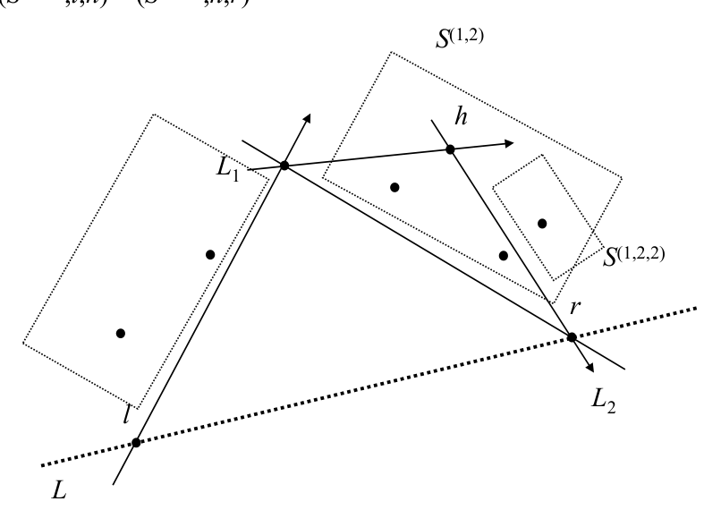

# Quickhull

## Scope
- **Slides:** pp. 225-234
- **Major topic folder:** convex-hulls
- **Recording files touching this material:** CS 564 - 02.25 10.1.txt, CS 564 - 02.27 11.1.txt
- **Goal of this file:** You should be able to study this topic without reopening the slide deck.

## Big picture
Quickhull is the quicksort-flavored hull algorithm: choose extreme points, split the set by a line, recurse on the outside sets, and pray your partitions are kind. Mathematics remains unmoved by your optimism.

## What you must know cold
- Initial split using extreme x-points.
- Find the farthest point from a hull edge / supporting line.
- Partition remaining points into recursive subproblems.

## Core ideas and reasoning
- The farthest point from segment ab becomes a hull vertex.
- Points inside the triangle formed by a, b, and the farthest point can be discarded from that recursive branch.
- Recurse on the two outer subsets.

## Figures to actually look at
These are cropped from the main slide PDF. Do not skip them.

### Figure from slide p. 227

### Figure from slide p. 230

## Slide-by-slide digestion

### p. 225 - Quickhull
- Quicksort
- The Quickhull algorithm is based on the Quicksort algorithm.
- Recall how quicksort operates: at each level of recursion,
- an array of numbers to be sorted is partitioned into two subarrays,
- such that each term of the first (left) subarray is not larger
- than each term of the second (right) subarray.
- LEFT
- RIGHT
- Two pointers to the array cells (LEFT and RIGHT)
- initially point to the opposite extreme ends of the array. We

### p. 226 - Quickhull
- Quickhull overview
- Quickhull operates in a similar manner.
- It recursively partitions the point set S,
- so as to find the convex hull for each subset.
- The hull at each level of the recursion is formed by
- concatenating the hulls found at the next level down.

### p. 227 - Quickhull
- Initial partition
- The initial partition of S is determined by a line L
- through the points l, r ∈S with the smallest and largest abscissa.
- S(1) ⊆S is the subset of S on or above L.
- S(2) ⊆S is the subset of S on or below L.
- Note that {S(1), S(2)} is not a partition of S,
- as S(1) ∩S(2) ⊇{l,r}. This is not a difficulty.
- The idea now is to construct hulls H(S(1)) and H(S(2)),
- then concatenate them to get H(S).
- The process is the same for S(1) and S(2), we consider S(1).

### p. 228 - Quickhull
- Finding the “apex”
- Find the point h ∈S(1) such that
- (1) triangle hlr has the maximum area of all triangles {plr : p ∈S(1)},
- and if there are > 1 triangles with maximum area,
- (2) the one where angle hlr is maximum.
- This condition ensures that h ∈H(S). Why?
- Construct a line parallel to line L through h, call it L′.
- There will be no points of S(1) (or S) above L′, by condition (1).
- There may be other points on L′, but h will be the leftmost,
- by condition (2),

### p. 229 - Quickhull
- Partitioning the point set
- Construct two directed lines, L1 from l to h, and L2 from h to r.
- Each point of S(1) is classified relative to L1 and L2
- (e.g., point-line classification).
- No point can be to the left of both L1 and L2.
- Points to the right of both are not in H(S),
- as they are within triangle hlr,
- and are eliminated from further consideration.
- Points left of L1 are S(1,1).
- Points left of L2 are S(1,2).

### p. 230 - Quickhull
- Recursion
- The process recurses on S(1,1) and are S(1,2).
- (set, left endpoint, right endpoint)
- (S(…),l,r)
- (S(…,1),l,h) (S(…,2),h,r)
- The recursion continues until S(…) has 0 points,
- i.e., all internal points have been eliminated,
- which implies that segment lr is an edge of H(S).
- S(1,2,2)

### p. 231 - Quickhull
- Geometric primitives
- The geometric primitives used by this algorithm are:
- 1. Point-line classification
- 2. Area of a triangle
- Both of these require O(1) time.

### p. 232 - Quickhull
- Initial partition, revisited
- The preceding explanation, while intuitive and thus useful,
- introduces an anomaly: l, r are in both S(1) and S(2).
- This is a problem because l, r will end up in both hulls.
- To the avoid this, base the initial partition on l0 = (x0, y0),
- the point of S with smallest abscissa,
- and r0 = (x0, y0 - ε), where ε is an arbitrarily small constant.

### p. 233 - Quickhull
- General function
- S is assumed to have at least 2 elements
- (the recursion ends otherwise).
- FURTHEST(S, l, r) is a function, not given here,
- that finds the apex point h as previously defined.
- The operator || denotes list concatenation.
- Procedure QUICKHULL returns an ordered list of points.
- procedure QUICKHULL(S, l, r)
- begin
- S = {l, r} then

### p. 234 - Quickhull
- Analysis
- Worst case time: O(N2)
- Expected time: O(N log N)
- Storage: O(N2)
- At each level of the recursion, partitioning S into S(1) and S(2)
- requires O(N) time. If S(1) and S(2) were guaranteed to have
- a size equal to a fixed portion of S, and this held at each level,
- the worst case time would be O(N log N).
- However, those criteria do not apply;
- S(1) and S(2) may have size in O(N) (they are not balanced).

## What you must be able to say or do in an exam
- State the input, output, preprocessing, and query/update model precisely.
- Explain the invariant or ordering that makes the method work.
- Trace the method by hand on a small example.
- Give the exact time and space bounds.
- Mention one edge case, degeneracy, or limitation.

## Complexity and performance facts
Expected around O(N log N) with good splits; worst case O(N^2).

## Common mistakes and danger points
- Do not claim guaranteed balanced recursion. That is exactly the algorithm’s weakness.

## Professor emphasis from recordings
These points are distilled from the related recordings and focus on what the professor slowed down for, warned about, or connected to homework/exam reasoning.

- Quickhull is repeatedly compared to Quicksort in the lecture, so the intended mental model is partition-recursion, not stack-based scanning.
- The exam risk here is forgetting that the appealing recursion picture does not automatically give the same worst-case guarantees as Graham's scan.

## Exam-style drills and answer skeletons
Existing drill reminders from the earlier pack:
- Adapted from HW2-Q5: Given vertices of a non-convex simple polygon in clockwise order, find its convex hull in O(N).

### Core exam drill
**Question.** State the problem solved by quickhull, describe preprocessing/query/update steps if any, and give the time and space bounds.

**How to answer.** An excellent answer names the input, the output, the invariant or ordering exploited by the method, and the exact asymptotic costs.

### Hand-trace drill
**Question.** Trace quickhull on a small example by hand and explain each comparison or structural change.

**How to answer.** On this course, being able to run the method on a picture matters more than writing vague slogans.

## Recap
### What you must know cold
- Initial split using extreme x-points.
- Find the farthest point from a hull edge / supporting line.
- Partition remaining points into recursive subproblems.
### Core test / key idea
- The farthest point from segment ab becomes a hull vertex.
- Points inside the triangle formed by a, b, and the farthest point can be discarded from that recursive branch.
- Recurse on the two outer subsets.
### Complexity
- Expected around O(N log N) with good splits; worst case O(N^2).
### Common mistakes / danger points
- Do not claim guaranteed balanced recursion. That is exactly the algorithm’s weakness.
### Professor emphasis (from recordings)
- Quickhull is repeatedly compared to Quicksort in the lecture, so the intended mental model is partition-recursion, not stack-based scanning.
- The exam risk here is forgetting that the appealing recursion picture does not automatically give the same worst-case guarantees as Graham's scan.
## End-of-file summary
- Initial split using extreme x-points.
- Find the farthest point from a hull edge / supporting line.
- Partition remaining points into recursive subproblems.
- Expected around O(N log N) with good splits; worst case O(N^2).
- Do not claim guaranteed balanced recursion. That is exactly the algorithm’s weakness.
- Quickhull is repeatedly compared to Quicksort in the lecture, so the intended mental model is partition-recursion, not stack-based scanning.

## Everything related to this topic
- **Previous file in reading order:** [Jarvis march (gift wrapping) in 2D](../convex-hulls/38_jarvis-march.md)
- **Next file in reading order:** [Divide-and-conquer convex hulls and hull union](../convex-hulls/40_divide-and-conquer-hull.md)
- **Source slide range:** pp. 225-234 of `comp_geometry_slides_new.pdf`
- **Related recordings:** CS 564 - 02.25 10.1.txt, CS 564 - 02.27 11.1.txt
- **Related homework-derived exam prompts included here:** none directly mapped; generic exam drills added instead