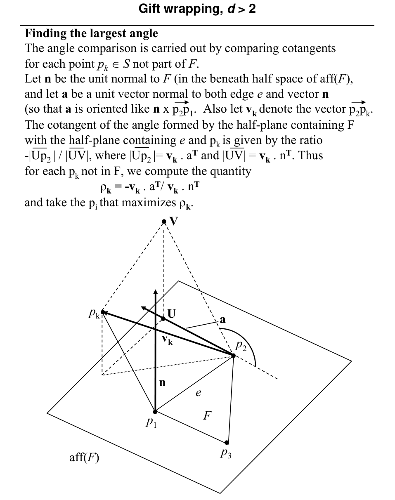

# Gift wrapping in higher dimensions: algorithm and adjacent facets

## Scope
- **Slides:** pp. 272-279
- **Major topic folder:** convex-hulls
- **Recording files touching this material:** CS 564 - 03.06 13.1.txt
- **Goal of this file:** You should be able to study this topic without reopening the slide deck.

## Big picture
This is Jarvis/gift wrapping generalized to facets. Instead of walking from one hull edge to the next, you walk from one hull facet to adjacent facets across shared subfacets.

## What you must know cold
- Facet adjacency via shared (d-2)-dimensional subfacets.
- How to find the next facet adjacent to a known facet.
- Queue/frontier view of the search over unprocessed boundary pieces.

## Core ideas and reasoning
- Starting from one known hull facet, examine its frontier subfacets.
- For each frontier subfacet, find the adjacent supporting facet that keeps all points on the correct side.
- Continue until all frontier subfacets are resolved.

## Figures to actually look at
These are cropped from the main slide PDF. Do not skip them.

### Figure from slide p. 275

### Figure from slide p. 277

## Slide-by-slide digestion

### p. 272 - Gift wrapping, d > 2
- Gift wrapping
- Proposed by Chand and Kapur (1970).
- Analyzed by Bhattacharya (1982).
- Specialized for d = 2 by Jarvis (1973), Jarvis’ march.
- Key idea: Given one facet (a (d-1)-face) of the convex hull,
- find a neighboring facet of the hull by “wrapping”
- a (d-1)-dimensional affine set around the point set.
- Continue from each facet to its neighbors until all facets are found.
- For example, in d = 3, imagine wrapping a sheet of 2-dimensional
- wrapping paper around a 3-dimensional gift box.

### p. 273 - Gift wrapping, d > 2
- Simplicial assumption
- As presented (here and in the text), the algorithm assumes that
- the resulting polytope (the convex hull) is simplicial.
- Recall that in a simplicial d-polytope, each facet is a (d-1)-simplex,
- and is determined by exactly d vertices.
- There will be no points in S coplanar with the d vertices that
- determine each facet of the convex hull.
- Theorem. In a simplicial d-polytope, a subfacet is shared by exactly
- two facets, and two facets F1 and F2 share a subfacet e
- iff e is determined by a common subset, with d - 1 vertices,

### p. 274 - Gift wrapping, d > 2
- Finding an adjacent facet, in general
- Let S = { p1, p2, … pN} be a finite set of points in d-space (Ed).
- Assume a facet F1 of H(S) is known, with all its subfacets.
- The mechanism to advance from F to an adjacent facet F′,
- which shares subfacet e with F,
- is to select from among all the points of S not vertices of F
- the point p′ such that all other points of S
- are beneath the hyperplane aff(e ∪p′).
- In other words, from among all the hyperplanes determined by e
- and a point p′ ∈S but not in F,

### p. 275 - Gift wrapping, d > 2
- Finding an adjacent facet, for d = 3
- Facet F is known. Consider the set of planes determined by edge e
- and the points of S and select the one which forms the largest
- angle < π (convex angle) with aff(F).
- Points p1, p2, p3 determine F, which determines aff(F).
- Compare the planes determined by e and p4, p5, p6, and p7.
- aff(F)

### p. 276 - Gift wrapping, d > 2
- Finding the largest angle
- The angle comparison is carried out by comparing cotangents
- for each point pk ∈S not part of F.
- The details are in the next slide.
- The time required for one advance is O(d3 + Nd).
- O(d3) to compute a vector needed for the angle comparisons,
- done once per advance (gift wrapping step).
- O(Nd) computing and comparing cotangents for O(N) points.
- aff(F)

### p. 277 - Gift wrapping, d > 2
- Finding the largest angle
- The angle comparison is carried out by comparing cotangents
- for each point pk ∈S not part of F.
- Let n be the unit normal to F (in the beneath half space of aff(F),
- and let a be a unit vector normal to both edge e and vector n
- (so that a is oriented like n x p2p1. Also let vk denote the vector p2pk.
- The cotangent of the angle formed by the half-plane containing F
- with the half-plane containing e and pk is given by the ratio
- -|Up2 | / |UV|, where |Up2 |= vk . aT and |UV| = vk . nT. Thus
- for each pk not in F, we compute the quantity

### p. 278 - Gift wrapping, d > 2
- Overview of the algorithm
- The algorithm starts from an initial facet.
- For each subfacet of it, construct the adjacent facets.
- Move to one of the new facets and continue until all facets
- have been constructed.
- A pool of subfacets which are candidates for being used is kept.
- A subfacet e, shared by facets F and F′, is a candidate to be used
- iff F or F′ but not both have been constructed.

### p. 279 - Gift wrapping, d > 2
- Algorithm
- Queue Q stores facets. File ℑstores the “pool” of subfacets.
- procedure GiftWrapping(S)
- begin
- Q = ∅
- ℑ= ∅
- F = find an initial convex hull facet
- insert into ℑall subfacets of F
- insert(F,Q) /* insert F into Q */
- while (Q ≠∅) do

## What you must be able to say or do in an exam
- State the input, output, preprocessing, and query/update model precisely.
- Explain the invariant or ordering that makes the method work.
- Trace the method by hand on a small example.
- Give the exact time and space bounds.
- Mention one edge case, degeneracy, or limitation.

## Complexity and performance facts
Depends on dimension and number of produced facets/subfacets.

## Common mistakes and danger points
- Facet adjacency is more subtle than edge adjacency in 2D; be clear what object is shared.

## Exam-style drills and answer skeletons
### Core exam drill
**Question.** State the problem solved by gift wrapping in higher dimensions: algorithm and adjacent facets, describe preprocessing/query/update steps if any, and give the time and space bounds.

**How to answer.** An excellent answer names the input, the output, the invariant or ordering exploited by the method, and the exact asymptotic costs.

### Hand-trace drill
**Question.** Trace gift wrapping in higher dimensions: algorithm and adjacent facets on a small example by hand and explain each comparison or structural change.

**How to answer.** On this course, being able to run the method on a picture matters more than writing vague slogans.

## Recap
### What you must know cold
- Facet adjacency via shared (d-2)-dimensional subfacets.
- How to find the next facet adjacent to a known facet.
- Queue/frontier view of the search over unprocessed boundary pieces.
### Core test / key idea
- Starting from one known hull facet, examine its frontier subfacets.
- For each frontier subfacet, find the adjacent supporting facet that keeps all points on the correct side.
- Continue until all frontier subfacets are resolved.
### Complexity
- Depends on dimension and number of produced facets/subfacets.
### Common mistakes / danger points
- Facet adjacency is more subtle than edge adjacency in 2D; be clear what object is shared.
## End-of-file summary
- Facet adjacency via shared (d-2)-dimensional subfacets.
- How to find the next facet adjacent to a known facet.
- Queue/frontier view of the search over unprocessed boundary pieces.
- Depends on dimension and number of produced facets/subfacets.
- Facet adjacency is more subtle than edge adjacency in 2D; be clear what object is shared.

## Everything related to this topic
- **Previous file in reading order:** [Gift wrapping in higher dimensions: background and setup](../convex-hulls/44_higher-dimensional-hull-background.md)
- **Next file in reading order:** [Gift wrapping in higher dimensions: supporting hyperplanes, initialization, candidates, and analysis](../convex-hulls/46_higher-dimensional-hull-init-analysis.md)
- **Source slide range:** pp. 272-279 of `comp_geometry_slides_new.pdf`
- **Related recordings:** CS 564 - 03.06 13.1.txt
- **Related homework-derived exam prompts included here:** none directly mapped; generic exam drills added instead