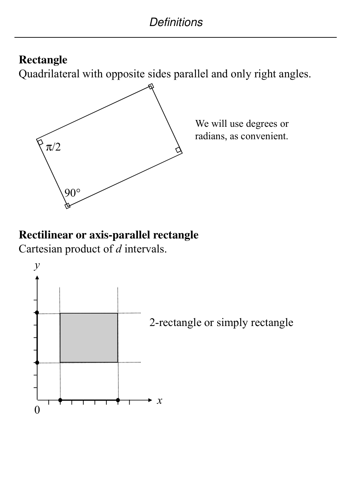

# Coordinate systems and basic geometric entities

## Scope
- **Slides:** pp. 9-18
- **Major topic folder:** geometric-objects-notation-and-asymptotic-preliminaries
- **Recording files touching this material:** CS 564 - 01.23 1.1.txt, CS 564 - 01.28 2.1.txt
- **Goal of this file:** You should be able to study this topic without reopening the slide deck.

## Big picture
This file is the foundation layer. The slides fix the language used everywhere else: what a point is, what a segment is, how a line is represented, and how dimension is written. If this part is shaky, later algorithms look magical when they are really just repeated uses of clean representations.

## What you must know cold
- Cartesian coordinates in d dimensions, and why d is part of the object model, not decoration.
- Difference between a line, a line segment, and a point as geometric objects.
- Parametric line equation and the meaning of restricting the parameter to [0,1] for a segment.
- Plane and axis-parallel / rectilinear rectangles as standard objects used in search problems.

## Core ideas and reasoning
- A point in d-space is an ordered d-tuple. This is the data representation that lets algorithms compare, sort, and test geometry.
- A line through p0 and p1 is represented parametrically as p(α) = p0 + α(p1 - p0). The segment is the same expression with 0 ≤ α ≤ 1.
- The parametric view is more useful than slope-intercept form in geometry algorithms because vertical lines do not need a special case.
- Later primitive tests such as point-line classification and segment intersection reduce to this representation.

## Figures to actually look at
These are cropped from the main slide PDF. Do not skip them.

### Figure from slide p. 17

### Figure from slide p. 18

## Slide-by-slide digestion

### p. 9 - Definitions
- Coordinate systems and dimensions
- The objects considered in Computational Geometry are points,
- lines, line segments, polygons, polyhedron, hyper-rectangles,
- etc.
- A coordinate system provides a means to specify positions
- or points in space.
- The Cartesian coordinate system labels a d-dimensional space
- with d mutually perpendicular (orthogonal) coordinate axes,
- one per dimension.
- d-dimensional space (d-space)

### p. 10 - Definitions
- Point
- Object with d dimensions and 0 extent.
- Location in d-space.
- Given as an ordered sequence of d coordinates.
- d = 1
- (x) or x
- d = 2
- d = 3
- (x, y, z)
- d ≥4

### p. 11 - Definitions
- Segment
- Finite 1-dimensional subset of a line,
- determined by two endpoints p0, p1.
- Ray
- Infinite 1-dimensional subset of a line
- determined by two points p0, p1 ∋p0 ≠p1,
- where one point is denoted as the endpoint.

### p. 12 - Point-Line classification
- We now consider the geometric primitive operation of
- classifying a point w.r.t. a line (both in the plane).
- A directed line segment partitions the plane into 7
- non-overlapping regions. The possibilities are shown below.
- The problem, given p0, p1, and p2, is to determine which
- region p2 lies in.
- beyond
- left
- terminus
- origin

### p. 13 - Parametric equation of a line
- We use the following equation of a line:
- line = {α(p0) + (1 - α)(p1) }, where α ∈ ℜ(real numbers)
- where p0 and p1 as usual are the points determining the line.
- p0 = (x0, y0)
- p1 = (x1, y1)
- Substituting gives
- {α(x0, y0) + (1 - α)(x1, y1) }
- Multiplying through gives the coordinates
- {αx0 + (1 - α)x1, αy0 + (1 - α)y1 }
- W k

### p. 14 - Line Segment
- A line segment is a closed subset of a line
- contained between two points which are
- called the end points. The subset is closed in
- the sense that it includes the end points.
- The equation of the line segment is the same
- as the parametric equation of a line with the
- restriction that α has the value 0<=α<=1.
- This is also called the convex combination
- of the two end points.

### p. 15 - Explicit Form of Line Equation
- y= mx +c
- m=slope=tanθ, where θ is the angle
- made by the line with positive x-axis
- c=intercept of the line with the y-axis.
- Vertical line with x=k cannot be represented
- since these lines have infinite slopes.
- Expressed in terms of the coordinates of two
- points on the line (x1,y1) and (x2,y2), we can
- write
- y=[(y2-y1)/(x2-x1)] x + (y1x2 -y2x1)/(x2-x1)

### p. 16 - can be specified as
- Ax + By + C = 0
- where A, B and C are constants. A
- vertical line is simply a line with B=0.
- Note the coefficients are not unique; for
- a given constant k, kA, kB and kC will
- give the same line.
- In general, in a d-dimension, given a set
- of k points p1, p2, .., pk, the set of points
- p= α1 p1+ α2 p2+….+ ακ pk
- such that the α−coefficients are real and

### p. 17 - Definitions
- Plane
- Infinite 2-dimensional subset of space,
- determined by three points p0, p1, p2, ∋ p0 ≠ p1 ≠ p2 ≠ p0;
- (p0, p1, and p2 must be non-collinear).
- Interval
- Pair of coordinate values.
- Often treated like a segment on a coordinate
- axis.
- [l, r]
- closed; x ∋l ≤x ≤r is within interval

### p. 18 - Definitions
- Rectilinear or axis-parallel rectangle
- Rectangle
- Quadrilateral with opposite sides parallel and only right angles.
- π/2
- We will use degrees or
- radians, as convenient.
- Rectilinear or axis parallel rectangle
- Cartesian product of d intervals.
- 2-rectangle or simply rectangle

## What you must be able to say or do in an exam
- Give the precise definitions.
- Distinguish similar notions cleanly.
- Use the right primitive test or formula on a concrete example.

## Complexity and performance facts
No main algorithm here. What matters is having constant-time primitive operations and a representation that avoids unnecessary case splits.

## Common mistakes and danger points
- Do not mix up affine combination (any real α) with convex combination (restricted coefficients).
- Do not assume every line has a slope; vertical-line special cases are exactly why parametric form is preferred.

## Exam-style drills and answer skeletons
### Definition drill
**Question.** Give the precise definitions and the most important consequences from coordinate systems and basic geometric entities.

**How to answer.** A strong answer distinguishes similar objects and uses the course terminology exactly.

## Recap
### What you must know cold
- Cartesian coordinates in d dimensions, and why d is part of the object model, not decoration.
- Difference between a line, a line segment, and a point as geometric objects.
- Parametric line equation and the meaning of restricting the parameter to [0,1] for a segment.
- Plane and axis-parallel / rectilinear rectangles as standard objects used in search problems.
### Core test / key idea
- A point in d-space is an ordered d-tuple. This is the data representation that lets algorithms compare, sort, and test geometry.
- A line through p0 and p1 is represented parametrically as p(α) = p0 + α(p1 - p0). The segment is the same expression with 0 ≤ α ≤ 1.
- The parametric view is more useful than slope-intercept form in geometry algorithms because vertical lines do not need a special case.
- Later primitive tests such as point-line classification and segment intersection reduce to this representation.
### Complexity
- No main algorithm here. What matters is having constant-time primitive operations and a representation that avoids unnecessary case splits.
### Common mistakes / danger points
- Do not mix up affine combination (any real α) with convex combination (restricted coefficients).
- Do not assume every line has a slope; vertical-line special cases are exactly why parametric form is preferred.
## End-of-file summary
- Cartesian coordinates in d dimensions, and why d is part of the object model, not decoration.
- Difference between a line, a line segment, and a point as geometric objects.
- Parametric line equation and the meaning of restricting the parameter to [0,1] for a segment.
- No main algorithm here. What matters is having constant-time primitive operations and a representation that avoids unnecessary case splits.
- Do not mix up affine combination (any real α) with convex combination (restricted coefficients).
- Do not assume every line has a slope; vertical-line special cases are exactly why parametric form is preferred.

## Everything related to this topic
- **Next file in reading order:** [Polygonal geometry, convexity, planarity, and polyhedra](../geometric-objects-notation-and-asymptotic-preliminaries/02_polygonal-geometry-planarity-and-polyhedra.md)
- **Source slide range:** pp. 9-18 of `comp_geometry_slides_new.pdf`
- **Related recordings:** CS 564 - 01.23 1.1.txt, CS 564 - 01.28 2.1.txt
- **Related homework-derived exam prompts included here:** none directly mapped; generic exam drills added instead