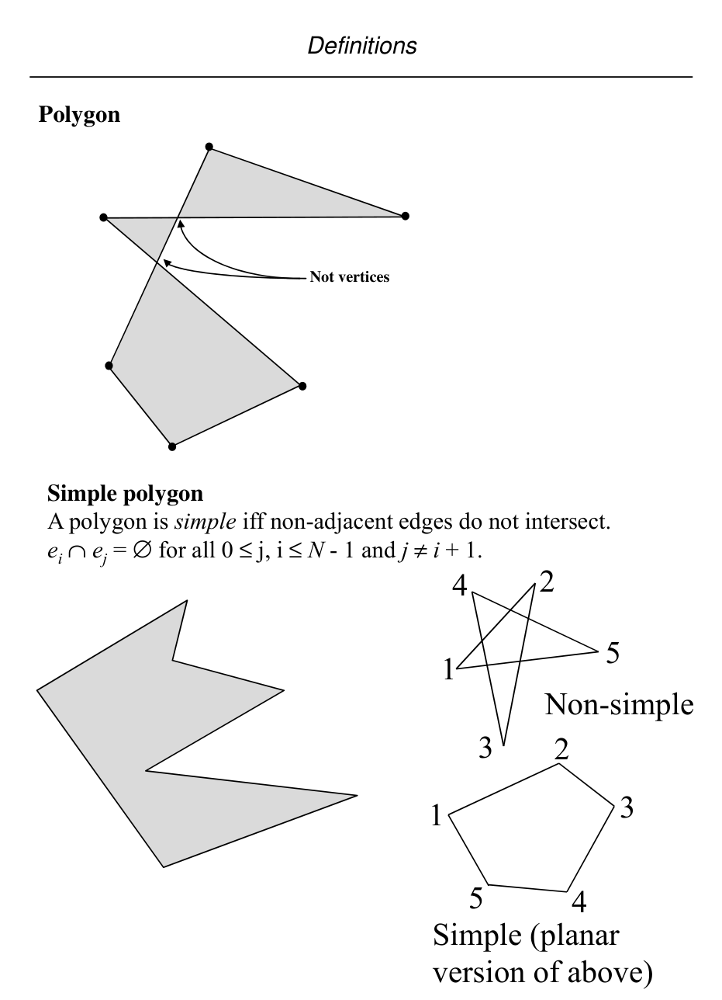

# Polygonal geometry, convexity, planarity, and polyhedra

## Scope
- **Slides:** pp. 19-28
- **Major topic folder:** geometric-objects-notation-and-asymptotic-preliminaries
- **Recording files touching this material:** CS 564 - 01.23 1.1.txt, CS 564 - 01.28 2.1.txt
- **Goal of this file:** You should be able to study this topic without reopening the slide deck.

## Big picture
This section tells you what kinds of geometric structures the course is willing to call legal. A surprising amount of later correctness depends on these definitions being exact.

## What you must know cold
- Simple polygon vs non-simple polygon, and why only a simple closed curve gives a clean inside/outside notion.
- Convex polygon definition in two equivalent forms: every internal segment stays inside, or every interior angle is less than π.
- Planar graph, planar embedding, faces, and the intuition behind Euler-style counting.
- Polyhedron and the analogue of simplicity / convexity in 3D.

## Core ideas and reasoning
- A polygon is not just the ordered list of vertices; it is the region bounded by the edges when the edges form a simple closed curve.
- Convexity is a structural property, not a visual vibe. The segment test and the interior-angle test are the important equivalent formulations.
- A planar embedding subdivides the plane into faces. This is what later point-location and DCEL algorithms are built on.
- In 3D, the analogous objects are polyhedra and their faces, edges, and vertices.

## Figures to actually look at
These are cropped from the main slide PDF. Do not skip them.

### Figure from slide p. 22

### Figure from slide p. 28

## Slide-by-slide digestion

### p. 19 - Definitions
- Dimensional prefixes on geometric object names
- No prefix “d-” means usual or expected number of dimensions
- for the object.
- rectangle = 2-rectangle
- cube = 3-cube
- Prefix “hyper-” means d is unspecified and it may be more than
- the usual number of dimensions for that object.
- hyper-rectangle = d-rectangle, d unspecified
- “d-dimensional rectilinear hyper-rectangle”

### p. 20 - Definitions
- Polygons
- O’Rourke, pp. 1-2
- A polygon is the region of a plane bounded by a finite set of
- segments forming a simple closed curve.
- (Note that we are working in d = 2 by definition.)
- Let v0, v1, ..., vN-1 be N points in the plane; the points are
- called vertices.
- Let e0 = v0v1, e1 = v1v2, ..., eN-1 = vN-1v0 be N segments
- connecting the points; the segments are called edges.
- The edges bound a polygon iff the intersection of each pair

### p. 21 - Definitions
- Interior and exterior
- Jordan curve theorem. Every simple closed plane curve
- divides the plane into two parts.
- Exterior
- Interior
- Boundary
- Polygon = interior ∪boundary
- If we are interested in just the interior or just the boundary,
- they will be referred to as such.
- (Same as true for other similar objects, e.g., rectangle.)

### p. 22 - Definitions
- Polygon
- Not vertices
- Simple polygon
- A polygon is simple iff non-adjacent edges do not intersect.
- ei ∩ej = ∅for all 0 ≤j, i ≤N - 1 and j ≠i + 1.
- Non-simple
- Simple (planar
- version of above)

### p. 23 - Definitions
- In computational geometry, the relative geometric positions
- matter, the edges do not correspond to abstract relations, as
- in Graph Theory.
- Convex polygon
- A polygon is convex if and only if for any two points in the
- polygon (interior ∪ boundary), the segment connecting the points
- is entirely within the polygon.
- convex
- not convex

### p. 24 - Convex Set
- Let p and q be two arbitrary points in a
- d-dimensional Euclidean space belonging
- to a set of points C. Then C is said to be
- convex if for all pairs (p, q) in C, the set
- of points
- [p + (1- α)q] ε C for 0<= α <=1
- That is, if two points p and q belong to C,
- then the set of points on the line segments
- connecting p and q also belong to C.
- When d=2, the points belong to a convex

### p. 25 - Planar Graph
- A graph G(V,E) is planar if it can be embedded
- in a plane without crossings.
- A straight line planar embedding of a planar
- graph determines a partition of the plane called
- planar subdivisions or a map.
- Let v= number of vertices, e= number of
- edges and f=number of faces.
- Theorem (Euler) : v - e + f = 2
- Proof: A simple polygon has always v=e and
- f=2 (interior and exterior).

### p. 26 - creates one extra face. v remains same, e becomes
- e+1 and f becomes f+1. So the equation remains
- valid. If a chain is used with t new vertices and
- necessarily with t+1 edges, we have v becomes
- v+t, e becomes e+t+1 and f becomes f+1. So, the
- Euler’s formula still remains valid.
- chord
- chain
- It can also be shown that for any planar graph,
- e <= 3v -6. Using Euler’s formula, we then
- have f <= 2/3 e and f <= 2v-4, giving the upper

### p. 27 - Polyhedron
- In 3-d Euclidean space, a polyhedron is defined
- to be a finite set of planar polygons such that every
- edge of the polygon is shared by exactly one other
- neighboring polygon and no subset of polygons
- has the same property (to avoid union of polygons).
- Edges and vertices have usual meaning. The
- polygons are called the facets of the polyhedron.
- A polyhedron is simple if there is no pair of
- non-adjacent facets sharing a point. A simple
- polyhedron partitions the 3-d space into two

### p. 28 - Definitions
- Vertices
- A polygon vertex is convex if its interior angle ≤ π (180°).
- It is reflex if its interior angle > π (180°).
- convex
- In a convex polygon, all the vertices are convex.

## What you must be able to say or do in an exam
- Give the precise definitions.
- Distinguish similar notions cleanly.
- Use the right primitive test or formula on a concrete example.

## Complexity and performance facts
No main complexity result, but this section sets up the combinatorial objects that later algorithms store and search.

## Common mistakes and danger points
- A self-intersecting polygon does not have a clean single interior in the sense used by these algorithms.
- Do not use “planar graph” and “specific straight-line embedding” as synonyms. The embedding matters.

## Exam-style drills and answer skeletons
### Definition drill
**Question.** Give the precise definitions and the most important consequences from polygonal geometry, convexity, planarity, and polyhedra.

**How to answer.** A strong answer distinguishes similar objects and uses the course terminology exactly.

## Recap
### What you must know cold
- Simple polygon vs non-simple polygon, and why only a simple closed curve gives a clean inside/outside notion.
- Convex polygon definition in two equivalent forms: every internal segment stays inside, or every interior angle is less than π.
- Planar graph, planar embedding, faces, and the intuition behind Euler-style counting.
- Polyhedron and the analogue of simplicity / convexity in 3D.
### Core test / key idea
- A polygon is not just the ordered list of vertices; it is the region bounded by the edges when the edges form a simple closed curve.
- Convexity is a structural property, not a visual vibe. The segment test and the interior-angle test are the important equivalent formulations.
- A planar embedding subdivides the plane into faces. This is what later point-location and DCEL algorithms are built on.
- In 3D, the analogous objects are polyhedra and their faces, edges, and vertices.
### Complexity
- No main complexity result, but this section sets up the combinatorial objects that later algorithms store and search.
### Common mistakes / danger points
- A self-intersecting polygon does not have a clean single interior in the sense used by these algorithms.
- Do not use “planar graph” and “specific straight-line embedding” as synonyms. The embedding matters.
## End-of-file summary
- Simple polygon vs non-simple polygon, and why only a simple closed curve gives a clean inside/outside notion.
- Convex polygon definition in two equivalent forms: every internal segment stays inside, or every interior angle is less than π.
- Planar graph, planar embedding, faces, and the intuition behind Euler-style counting.
- No main complexity result, but this section sets up the combinatorial objects that later algorithms store and search.
- A self-intersecting polygon does not have a clean single interior in the sense used by these algorithms.
- Do not use “planar graph” and “specific straight-line embedding” as synonyms. The embedding matters.

## Everything related to this topic
- **Previous file in reading order:** [Coordinate systems and basic geometric entities](../geometric-objects-notation-and-asymptotic-preliminaries/01_coordinate-systems-and-basic-entities.md)
- **Next file in reading order:** [Computational models and complexity language](../geometric-objects-notation-and-asymptotic-preliminaries/03_models-and-complexity-language.md)
- **Source slide range:** pp. 19-28 of `comp_geometry_slides_new.pdf`
- **Related recordings:** CS 564 - 01.23 1.1.txt, CS 564 - 01.28 2.1.txt
- **Related homework-derived exam prompts included here:** none directly mapped; generic exam drills added instead