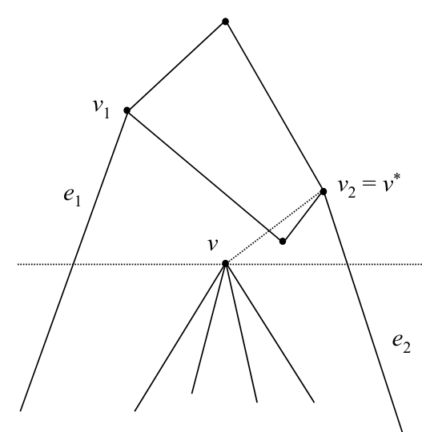
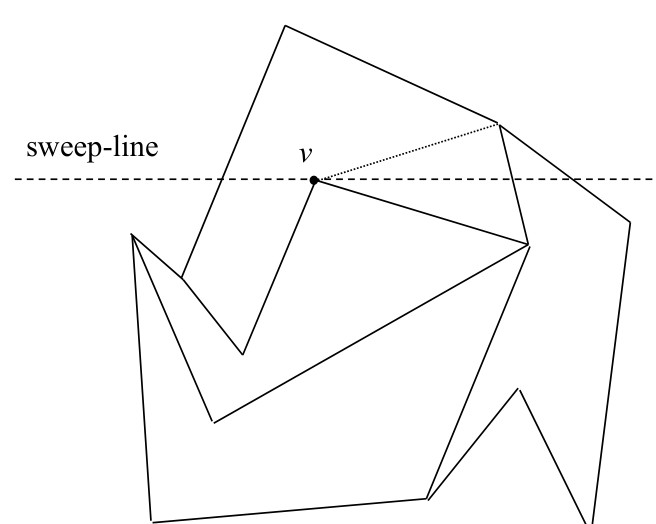

# Chain method: regularization of arbitrary PSLGs

## Scope
- **Slides:** pp. 110-115
- **Major topic folder:** geometric-search
- **Recording files touching this material:** CS 564 - 02.06 5.2.txt
- **Goal of this file:** You should be able to study this topic without reopening the slide deck.

## Big picture
Regularization is the unpleasant but necessary surgery step. Arbitrary PSLGs do not automatically satisfy the assumptions the chain method wants, so the structure is repaired first.

## What you must know cold
- Why arbitrary PSLGs may violate regularity assumptions.
- How adding structure or splitting edges/vertices restores regularity.
- Why this preprocessing does not change the point-location answer.

## Core ideas and reasoning
- The regularization pass removes problematic local configurations that would break monotone-chain decomposition.
- The goal is to preserve the subdivision semantics while making the combinatorics suitable for binary search.

## Figures to actually look at
These are cropped from the main slide PDF. Do not skip them.

### Figure from slide p. 112

### Figure from slide p. 114

## Slide-by-slide digestion

### p. 110 - Regularizing an arbitrary PSLG
- A vertex fails to be regular if incoming or outgoing edges
- mandated by the definition are missing.
- In the example, v6 has no outgoing edge and is not regular.
- To regularize a PSLG, the missing edges must be added
- to those vertices where they are missing.
- A PSLG is regularized by regularizing each non-regular vertex.
- The process may add “artificial” faces by splitting existing ones.
- The two faces share the same identity for point location purposes.

### p. 111 - Regularizing a vertex, part 1
- Consider a nonregular vertex v with no outgoing edges.
- A horizontal line through v will intersect at least one
- and at most two edges adjacent to v on either side.
- (There may be additional intersected edges beyond e1 and e2,
- these are the adjacent ones.)
- There will be at least one such edge because v is not extremal
- (v ≠v1, v ≠vN).
- Let v1 be the upper endpoint of e1 ,
- and let v2 be the upper endpoint of e2.
- (These indices are for the example, they are not the regular indices.)

### p. 112 - Regularizing a vertex, part 2
- Text, p. 52:
- “Then the segment vv* does not cross any edge of G and therefore
- can be added to the PSLG, thereby regularizing vertex v.”
- Is that correct? I don’t think so. Consider the example.
- v2 = v*
- Edges e1 and e2 are still the edges adjacent to the non-regular
- vertex v along the horizontal line, but edge vv* can not
- be added to G.

### p. 113 - Regularizing a vertex, part 3
- We turn from the observation to the regularization process.
- In overview:
- Regularization requires two plane sweeps of the PSLG:
- 1. top-to-bottom, to regularize vertices with no outgoing edge
- 2. bottom-to-top, to regularize vertices with no incoming edge
- Consider the top-to-bottom sweep.
- The event-point schedule is the vertex sequence (vN, vN-1, ..., v1).
- The sweep-line status data structure maintains
- 1. the left-to-right order of the intersections of the sweep-line with
- the PSLG, which induce intervals along the sweep-line, and

### p. 114 - Regularizing a vertex, part 4
- For each event (each vertex v):
- 1. Find the interval in the sweep-line status that contains v.
- 2. Update the sweep-line status.
- 3. If v is not regular, add an edge from v to the vertex
- associated in the sweep-line status data structure with the
- interval found for v in step 1.
- Each sweep requires O(N log N) time; it may be necessary to sort
- the vertices into the event-point schedule requiring O(N log N) time,
- and during the sweep there will be O(N) insertions and deletions,
- each requiring O(log N) time.

### p. 115 - Regularizing a vertex, part 5
- Does the process actually run in O(N log N) time? I’m not sure.
- How do we know whether to connect v to v1 or v2 ?
- By whether v is to right or to the left of the intersection of edge e
- and the sweep-line, which must be computed at the event for v.
- ⇒The intersection point with the sweep-line for all active edges
- (i.e., those in the sweep-line status data structure) must be computed
- at each event.
- ⇒O(N) processing per event.
- ⇒O(N2) total processing.
- sweep-line

## What you must be able to say or do in an exam
- State the input, output, preprocessing, and query/update model precisely.
- Explain the invariant or ordering that makes the method work.
- Trace the method by hand on a small example.
- Give the exact time and space bounds.
- Mention one edge case, degeneracy, or limitation.

## Complexity and performance facts
This preprocessing can dominate implementation complexity; the query benefit comes afterward.

## Common mistakes and danger points
- Textbook/slides may gloss over details. If a configuration breaks regularity, you must say how it is fixed.
- Regularization should preserve face containment answers.

## Professor emphasis from recordings
These points are distilled from the related recordings and focus on what the professor slowed down for, warned about, or connected to homework/exam reasoning.

- Regularization is treated as the repair step that forces an arbitrary PSLG into the conditions required by the chain method.
- The key thing to remember is not the cosmetic picture change, but why regularity is needed so each horizontal slice behaves predictably.

## Exam-style drills and answer skeletons
Existing drill reminders from the earlier pack:
- Adapted from HW2-Q4: Modify graph-weight balancing so the second pass constructs a monotone complete set of chains.

### Core exam drill
**Question.** State the problem solved by chain method: regularization of arbitrary pslgs, describe preprocessing/query/update steps if any, and give the time and space bounds.

**How to answer.** An excellent answer names the input, the output, the invariant or ordering exploited by the method, and the exact asymptotic costs.

### Hand-trace drill
**Question.** Trace chain method: regularization of arbitrary pslgs on a small example by hand and explain each comparison or structural change.

**How to answer.** On this course, being able to run the method on a picture matters more than writing vague slogans.

## Recap
### What you must know cold
- Why arbitrary PSLGs may violate regularity assumptions.
- How adding structure or splitting edges/vertices restores regularity.
- Why this preprocessing does not change the point-location answer.
### Core test / key idea
- The regularization pass removes problematic local configurations that would break monotone-chain decomposition.
- The goal is to preserve the subdivision semantics while making the combinatorics suitable for binary search.
### Complexity
- This preprocessing can dominate implementation complexity; the query benefit comes afterward.
### Common mistakes / danger points
- Textbook/slides may gloss over details. If a configuration breaks regularity, you must say how it is fixed.
- Regularization should preserve face containment answers.
### Professor emphasis (from recordings)
- Regularization is treated as the repair step that forces an arbitrary PSLG into the conditions required by the chain method.
- The key thing to remember is not the cosmetic picture change, but why regularity is needed so each horizontal slice behaves predictably.
## End-of-file summary
- Why arbitrary PSLGs may violate regularity assumptions.
- How adding structure or splitting edges/vertices restores regularity.
- Why this preprocessing does not change the point-location answer.
- This preprocessing can dominate implementation complexity; the query benefit comes afterward.
- Textbook/slides may gloss over details. If a configuration breaks regularity, you must say how it is fixed.
- Regularization should preserve face containment answers.

## Everything related to this topic
- **Previous file in reading order:** [Chain method: regular PSLGs and constructing the chain family](../geometric-search/18_chain-method-constructing-chains.md)
- **Next file in reading order:** [Chain method: analysis and wrap-up](../geometric-search/20_chain-method-analysis.md)
- **Source slide range:** pp. 110-115 of `comp_geometry_slides_new.pdf`
- **Related recordings:** CS 564 - 02.06 5.2.txt
- **Related homework-derived exam prompts included here:** none directly mapped; generic exam drills added instead