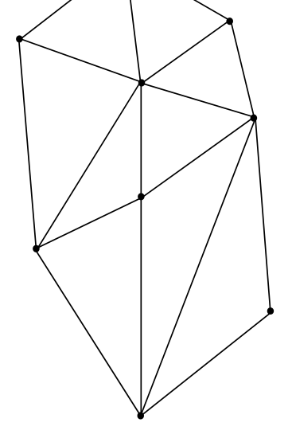
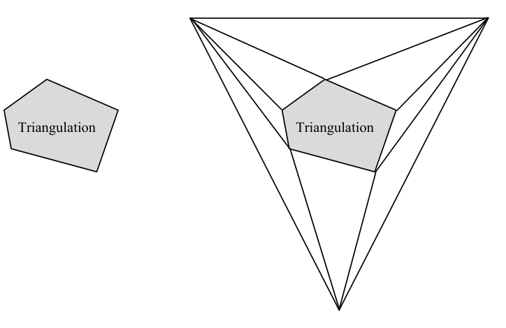

# Triangle refinement: setup and triangulation

## Scope
- **Slides:** pp. 118-122
- **Major topic folder:** geometric-search
- **Recording files touching this material:** CS 564 - 02.11 6.1.txt
- **Goal of this file:** You should be able to study this topic without reopening the slide deck.

## Big picture
Triangle refinement is the second major point-location framework. Instead of chains, it builds a hierarchy of triangulations plus a search DAG.

## What you must know cold
- Triangulate the PSLG.
- Build a sequence of coarser/finer triangulations.
- Interpret the links between levels as a directed acyclic search graph.

## Core ideas and reasoning
- A triangle at one level points to the few triangles that refine it at the next level.
- The hierarchy turns point location into a descent through progressively smaller containing triangles.

## Figures to actually look at
These are cropped from the main slide PDF. Do not skip them.

### Figure from slide p. 119

### Figure from slide p. 120

## Slide-by-slide digestion

### p. 118 - Triangle refinement method
- PSLG G
- Directed acyclic
- search graph T
- Triangulated PSLG G
- Triangulate PSLG G
- (To be covered later)
- Construct sequence of triangulations
- and directed acyclic search graph T
- (PS pp. 56-58)
- Queries

### p. 119 - Triangulation
- A planar subdivision (e.g., a PSLG) is a triangulation
- if all its bounded regions are triangles.
- Not a triangulation
- Triangulation
- A triangulation of a finite set of points S is a planar graph on S
- with the maximum number of edges. There may be more than
- one triangulation for a given S, but they all have this property.
- The number of edges in a triangulation is at most 3N - 6,
- where N is the number of vertices. (Prove this statement by
- applying induction on N).

### p. 120 - Triangulating G, part 1
- We assume that the PSLG given in the point location problem is
- a triangulation; if not, it is transformed into one in O(N) time.
- We will study triangulation algorithms later.
- We further assume that the triangulation has a triangular boundary.
- If not, one can be added in O(1) time by adding three vertices
- and triangulating the “inbetween” region.
- This will produce a triangulation with the maximum
- number of edges 3N-6. ( Prove this statement)
- Triangulation

### p. 121 - Triangulating G, part 2
- Note that the text, published in 1985, says O(N log N) time is
- needed for the triangulation (p. 56).
- Chazelle published an O(N) triangulation algorithm in 1991;
- see O’Rourke pp. 64-65.
- Explaining Chazelle’s algorithm would be a (challenging)
- course project.
- Hereinafter, we assume:
- 1. G is a triangulation
- 2. G has a triangular boundary
- 3. G has exactly 3N - 6 edges (∈O(N))

### p. 122 - Triangle refinement method
- PSLG G
- Directed acyclic
- search graph T
- Triangulated PSLG G
- Triangulate PSLG G
- (To be covered later)
- Construct a sequence of triangulations
- and directed acyclic search graph T
- (PS pp. 56-58)
- Queries

## What you must be able to say or do in an exam
- State the input, output, preprocessing, and query/update model precisely.
- Explain the invariant or ordering that makes the method work.
- Trace the method by hand on a small example.
- Give the exact time and space bounds.
- Mention one edge case, degeneracy, or limitation.

## Complexity and performance facts
Preprocessing constructs the triangulations and DAG; query follows one path down the DAG.

## Common mistakes and danger points
- The hierarchy is over triangulations, not arbitrary faces.
- You need the containment/refinement relationship to justify the search path.

## Exam-style drills and answer skeletons
### Core exam drill
**Question.** State the problem solved by triangle refinement: setup and triangulation, describe preprocessing/query/update steps if any, and give the time and space bounds.

**How to answer.** An excellent answer names the input, the output, the invariant or ordering exploited by the method, and the exact asymptotic costs.

### Hand-trace drill
**Question.** Trace triangle refinement: setup and triangulation on a small example by hand and explain each comparison or structural change.

**How to answer.** On this course, being able to run the method on a picture matters more than writing vague slogans.

## Recap
### What you must know cold
- Triangulate the PSLG.
- Build a sequence of coarser/finer triangulations.
- Interpret the links between levels as a directed acyclic search graph.
### Core test / key idea
- A triangle at one level points to the few triangles that refine it at the next level.
- The hierarchy turns point location into a descent through progressively smaller containing triangles.
### Complexity
- Preprocessing constructs the triangulations and DAG; query follows one path down the DAG.
### Common mistakes / danger points
- The hierarchy is over triangulations, not arbitrary faces.
- You need the containment/refinement relationship to justify the search path.
## End-of-file summary
- Triangulate the PSLG.
- Build a sequence of coarser/finer triangulations.
- Interpret the links between levels as a directed acyclic search graph.
- Preprocessing constructs the triangulations and DAG; query follows one path down the DAG.
- The hierarchy is over triangulations, not arbitrary faces.
- You need the containment/refinement relationship to justify the search path.

## Everything related to this topic
- **Previous file in reading order:** [Chain method: analysis and wrap-up](../geometric-search/20_chain-method-analysis.md)
- **Next file in reading order:** [Triangle refinement: hierarchy, query, storage, and analysis](../geometric-search/22_triangle-refinement-query-and-analysis.md)
- **Source slide range:** pp. 118-122 of `comp_geometry_slides_new.pdf`
- **Related recordings:** CS 564 - 02.11 6.1.txt
- **Related homework-derived exam prompts included here:** none directly mapped; generic exam drills added instead