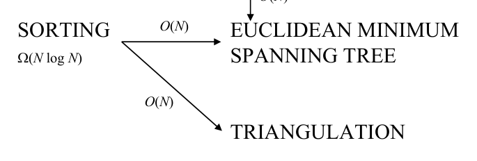

# Proximity lower bounds and transformations

## Scope
- **Slides:** pp. 300-307
- **Major topic folder:** proximity
- **Recording files touching this material:** CS 564 - 03.11 14.1.txt, CS 564 - 03.13 15.1a.txt, CS 564 - 03.13 15.1b.txt, CS 564 - 03.25 16.1.txt, Mar 13, 1.47 PM​.txt
- **Goal of this file:** You should be able to study this topic without reopening the slide deck.

## Big picture
This section extends the reduction logic from convex hull to proximity problems. It is extremely exam-friendly because it tests understanding of transformations, not memorization of geometry.

## What you must know cold
- How reductions transfer lower bounds among element uniqueness, closest pair, all nearest neighbors, EMST, and triangulation.
- Input transformation vs output extraction.
- Why transformation direction matters.

## Core ideas and reasoning
- For example, element uniqueness reduces to closest pair by mapping x_i to points (x_i,0). Duplicate numbers produce zero-distance pairs.
- Closest pair can reduce to all-nearest-neighbors by scanning the nearest-neighbor pairs for the minimum distance.
- The transformation cost must not dominate the lower bound you want to transfer.

## Figures to actually look at
These are cropped from the main slide PDF. Do not skip them.

### Figure from slide p. 300

### Figure from slide p. 307

## Slide-by-slide digestion

### p. 300 - Lower bounds
- The proximity problems we have defined can be transformed
- into each other as follows:
- ELEMENT
- CLOSEST
- ALL NEAREST
- UNIQUENESS
- PAIR
- NEIGHBORS
- Ω(N log N)
- SORTING

### p. 301 - Search problems
- BINARY SEARCH ∝O(1) NEAREST NEIGHBOR SEARCH
- BINARY SEARCH ∝O(1) k-NEAREST NEIGHBORS
- Preparata defines BINARY SEARCH in a slightly unusual way,
- apparently to simplify the lower bounds proof.
- BINARY SEARCH
- INSTANCE: Set S = {x1, x2, ..., xN} of N real numbers and
- query real number q.
- Assume that for 1≤i, j ≤N, i < j ⇔xi < xj (preprocessing).
- QUESTION (Usual): Find xi such that xi ≤q < xi+1.
- QUESTION (Preparata): Find xi closest to q.

### p. 302 - BINARY SEARCH has lower bound in Ω(log N).
- Transform BINARY SEARCH
- to NEAREST NEIGHBOR SEARCH as follows:
- 1. Transform instance of BINARY SEARCH:
- S = {x1, x2, ..., xN} and q
- to an instance of NEAREST NEIGHBOR SEARCH:
- S′ = {(x1,0), (x2,0), ..., (xN,0)} and q′ = (q,0). O(N) time.
- 2. Solve NEAREST NEIGHBOR SEARCH for S′ and q′;
- let (xi,0) be the solution.
- 3. Transform solution point (xi,0) to real number xi,
- which is the solution to BINARY SEARCH. O(1) time.

### p. 303 - But, there seems to be a problem with this proof,
- as given in Preparata, p. 193:
- The O(N) transformation dominates the Ω(log N) lower bound,
- voiding the result.
- We can get around that by considering the 1-dimensional version
- of NEAREST NEIGHBOR SEARCH, which has an instance
- identical to the instance of BINARY SEARCH.
- This resolution still has two difficulties:
- 1. It assumes that 2-dimensional NEAREST NEIGHBOR
- SEARCH has the same lower bound as the 1-dimensional
- version (this is probably easily proven).

### p. 304 - ELEMENT UNIQUENESS has lower bound in Ω(N log N).
- Transform ELEMENT UNIQUENESS
- to CLOSEST PAIR as follows:
- 1. Transform instance of ELEMENT UNIQUENESS:
- S = {x1, x2, ..., xN}
- to an instance of CLOSEST PAIR:
- S′ = {(x1,0), (x2,0), ..., (xN,0)}. O(N) time.
- 2. Solve CLOSEST PAIR for S′;
- let (xi,0) and (xj,0) be the solution (the two closest points).
- 3. Transform this into a solution to ELEMENT UNIQUENESS:
- If xi = xj, return FALSE, else return TRUE.

### p. 305 - All nearest neighbors
- CLOSEST PAIR has lower bound in Ω(N log N).
- Transform CLOSEST PAIR
- to ALL NEAREST NEIGHBORS as follows:
- 1. An instance of CLOSEST PAIR:
- S = {p1, p2, ..., pN}
- is an instance of ALL NEAREST NEIGHBORS:
- S = {p1, p2, ..., pN}. O(0) time.
- 2. Solve ALL NEAREST NEIGHBORS for S;
- let A = {(p1,q1), (p2,q2), …, (pN,qN)} be the solution
- (qi ∈S, a nearest neighbor for each point in S).

### p. 306 - Euclidean minimum spanning tree
- SORTING has lower bound in Ω(N log N).
- Transform SORTING
- to EUCLIDEAN MINIMUM SPANNING TREE (EMST) as follows:
- 1. An instance of SORTING:
- S = {x1, x2, ..., xN}
- to an instance of EMST:
- S′ = {(x1,0), (x2,0), ..., (xN,0)}. O(N) time.
- 2. Solve EMST for S′.
- A set of points along the x axis has a unique EMST,
- where there is an edge ((xi,0),(xj,0))

### p. 307 - Triangulation
- SORTING has lower bound in Ω(N log N).
- Transform SORTING to TRIANGULATION as follows:
- 1. An instance of SORTING:
- S = {x1, x2, ..., xN}
- to an instance of TRIANGULATION:
- S′ = {(x1,0), (x2,0), ..., (xN,0)} ∪{(0,-1)}. O(N) time.
- 2. Solve TRIANGULATION for S′.
- Set of points S′ has a unique triangulation,
- shown in the figure.
- Let T = {(xi1,xj1), (xi2,xj2), …, (xiN,xjN)} be the solution

## What you must be able to say or do in an exam
- State the claim precisely before giving the argument.
- Identify the known lower bound / recurrence / invariant you are using.
- Keep the direction of the argument correct.
- End with the exact asymptotic conclusion.

## Complexity and performance facts
Course claim: these proximity problems inherit Ω(N log N) lower bounds in the standard model.

## Common mistakes and danger points
- Students often reverse the reduction direction or produce an algorithm instead of a reduction proof.
- Output extraction must actually reconstruct the original problem answer.

## Professor emphasis from recordings
These points are distilled from the related recordings and focus on what the professor slowed down for, warned about, or connected to homework/exam reasoning.

- Again the professor returns to transformation direction: to transfer a lower bound, you need a fast transformation from the known-hard problem to the target problem.
- A classic trap mentioned in lecture is proposing a transformation whose conversion step is already too expensive, which destroys the claimed lower bound.

## Exam-style drills and answer skeletons
Existing drill reminders from the earlier pack:
- Show element uniqueness ≤ closest pair using an explicit input and output transformation.
- Show closest pair ≤ all nearest neighbors and conclude a lower bound.
- Explain why a failed reverse transformation does not disprove the correct reduction direction.

### Lower-bound drill
**Question.** Use a problem transformation to transfer a known Ω(N log N) lower bound to another proximity problem.

**How to answer.** You must name the source problem, the target problem, the transformation cost, and the contradiction that would arise if the target were asymptotically faster.

### Proof drill
**Question.** Explain the main argument in proximity lower bounds and transformations in a logically correct order.

**How to answer.** Do not jump from intuition to conclusion. State the reduction/invariant/recurrence first, then derive the claimed bound.

## Recap
### What you must know cold
- How reductions transfer lower bounds among element uniqueness, closest pair, all nearest neighbors, EMST, and triangulation.
- Input transformation vs output extraction.
- Why transformation direction matters.
### Core test / key idea
- For example, element uniqueness reduces to closest pair by mapping x_i to points (x_i,0). Duplicate numbers produce zero-distance pairs.
- Closest pair can reduce to all-nearest-neighbors by scanning the nearest-neighbor pairs for the minimum distance.
- The transformation cost must not dominate the lower bound you want to transfer.
### Complexity
- Course claim: these proximity problems inherit Ω(N log N) lower bounds in the standard model.
### Common mistakes / danger points
- Students often reverse the reduction direction or produce an algorithm instead of a reduction proof.
- Output extraction must actually reconstruct the original problem answer.
### Professor emphasis (from recordings)
- Again the professor returns to transformation direction: to transfer a lower bound, you need a fast transformation from the known-hard problem to the target problem.
- A classic trap mentioned in lecture is proposing a transformation whose conversion step is already too expensive, which destroys the claimed lower bound.
## End-of-file summary
- How reductions transfer lower bounds among element uniqueness, closest pair, all nearest neighbors, EMST, and triangulation.
- Input transformation vs output extraction.
- Why transformation direction matters.
- Course claim: these proximity problems inherit Ω(N log N) lower bounds in the standard model.
- Students often reverse the reduction direction or produce an algorithm instead of a reduction proof.
- Output extraction must actually reconstruct the original problem answer.

## Everything related to this topic
- **Previous file in reading order:** [Proximity problem family: survey and relations](../proximity/47_proximity-problem-survey.md)
- **Next file in reading order:** [Closest pair: problem setup and 1D version](../proximity/49_closest-pair-setup-1d.md)
- **Source slide range:** pp. 300-307 of `comp_geometry_slides_new.pdf`
- **Related recordings:** CS 564 - 03.11 14.1.txt, CS 564 - 03.13 15.1a.txt, CS 564 - 03.13 15.1b.txt, CS 564 - 03.25 16.1.txt, Mar 13, 1.47 PM​.txt
- **Related homework-derived exam prompts included here:** Lower-bound drill