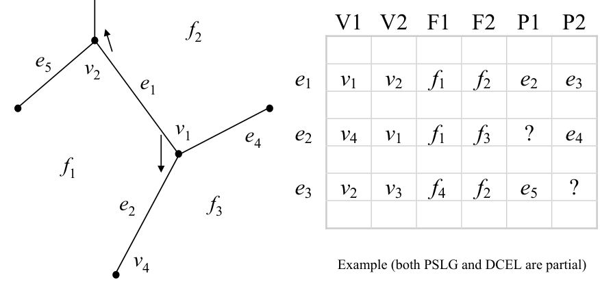
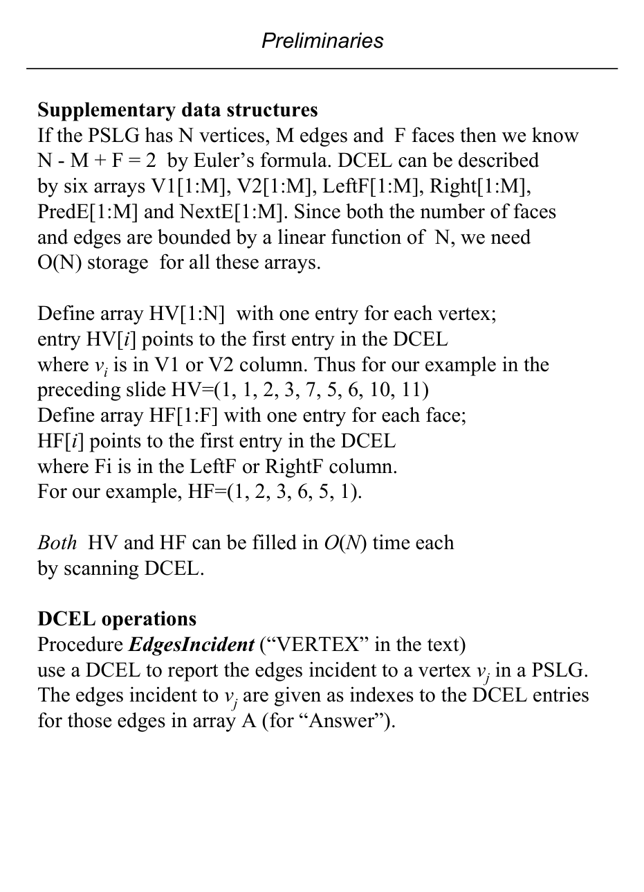

# DCEL representation and auxiliary structures

## Scope
- **Slides:** pp. 47-51
- **Major topic folder:** pslgs-dcels-vectors-and-geometric-primitives
- **Recording files touching this material:** CS 564 - 01.23 1.2.txt, CS 564 - 01.30 3.1.txt
- **Goal of this file:** You should be able to study this topic without reopening the slide deck.

## Big picture
The DCEL is the workhorse representation for planar subdivisions. If the professor asks you to actually manipulate a subdivision, this is the structure you are expected to think in.

## What you must know cold
- Each edge record stores origin, destination, left face, right face, and predecessor/successor-style incidence links.
- How to recover vertex-incidence and face-boundary information from the records.
- How auxiliary arrays for vertices/faces support traversal.
- Why DCEL is a representation for embeddings, not just connectivity.

## Core ideas and reasoning
- The orientation of an edge record matters because left-face and right-face fields depend on it.
- Traversing around a face or around a vertex is done by following linked incidence pointers, not by rescanning all edges.
- Many exam/homework questions on DCEL reduce to building the correct dual or incidence traversal.

## Figures to actually look at
These are cropped from the main slide PDF. Do not skip them.

### Figure from slide p. 47

### Figure from slide p. 49

## Slide-by-slide digestion

### p. 47 - Doubly connected edge list (DCEL)
- The DCEL data structure represents a PSLG.
- It has one entry (“edge node” in text) for each edge in the PSLG.
- Each entry has 6 fields:
- V1 Origin of the edge
- V2 Terminus (destination) of the edge; implies an orientation
- Face to the left of edge, relative to V1V2 orientation
- Face to the right of edge, relative to V1V2 orientation
- Index of entry for first edge encountered after edge V1V2,
- when proceeding counterclockwise around V1
- Index of entry for first edge after edge V1V2,

### p. 48 - Concrete DCEL table example
- This slide is the worked table for one planar subdivision encoded as a DCEL.
- Read each row as one directed edge together with its origin, destination, left face, right face, predecessor edge, and successor edge.
- The point of the page is not memorizing the numbers. The point is being able to decode one row correctly.

### p. 49 - Supplementary data structures
- If the PSLG has N vertices, M edges and F faces then we know
- N - M + F = 2 by Euler’s formula. DCEL can be described
- by six arrays V1[1:M], V2[1:M], LeftF[1:M], Right[1:M],
- PredE[1:M] and NextE[1:M]. Since both the number of faces
- and edges are bounded by a linear function of N, we need
- O(N) storage for all these arrays.
- Define array HV[1:N] with one entry for each vertex;
- entry HV[i] points to the first entry in the DCEL
- where vi is in V1 or V2 column. Thus for our example in the
- preceding slide HV=(1, 1, 2, 3, 7, 5, 6, 10, 11)

### p. 50 - procedure EdgesIncident(j) /* VERTEX in text */
- begin
- a = HV[j]
- /* Get first DCEL entry for vj, a is index. */
- a0 = a
- /* Save starting index. */
- A[1] = a
- i = 2
- /* i is index for A */
- if (V1[a] = j) then
- a =PredE[a]

### p. 51 - DCEL notes
- Error in text, p. 16: “... scan of arrays V1 and F1 ...”
- to produce HV and HF.
- Actually V1 and V2 (and F1 and F2) must be scanned.
- What if a vertex was V2 only?
- The algorithm would fail if only V1 was scanned.
- EdgesIncident requires time proportional to the number of
- incident edges reported.
- How does that relate to N, the number of vertices in the PSLG?
- We have these facts about planar graphs (and thus PSLGs):
- (1) v - e + f = 2

## What you must be able to say or do in an exam
- State the input, output, preprocessing, and query/update model precisely.
- Explain the invariant or ordering that makes the method work.
- Trace the method by hand on a small example.
- Give the exact time and space bounds.
- Mention one edge case, degeneracy, or limitation.

## Complexity and performance facts
Local incidence operations are constant time once the structure is built; naive global tasks may still be O(E) or O(N).

## Common mistakes and danger points
- Left/right face is relative to the edge orientation. Get the orientation wrong and every face answer flips.
- Do not forget the outer face. Homework questions often include it.

## Professor emphasis from recordings
These points are distilled from the related recordings and focus on what the professor slowed down for, warned about, or connected to homework/exam reasoning.

- The lecture treats DCEL as the representation you are supposed to think in for planar subdivisions: many later questions reduce to walking the correct pointer cycle instead of rescanning the whole graph.
- A practical warning tied to this material is that orientation matters. Left face and right face are relative to the directed edge, so reversing the edge flips the interpretation.
- He also links the representation to homework-style graph facts: once the subdivision is represented correctly, Euler-based bounds and face-adjacency questions become manageable.
- When constructing DCEL helper information (e.g., first incident edge for a vertex/face), check both endpoint/face columns; do not look only at one side.

## Exam-style drills and answer skeletons
Existing drill reminders from the earlier pack:
- Build the dual graph of faces from a DCEL and test whether it is bipartite to decide 2-colorability of faces.
- Given a face F, delete exactly the edges whose two incident faces lie in {F} union Neighbors(F) to expand F by union with adjacent faces.
- Given a query point P, scan edges with a horizontal ray and return the first crossed edge to identify the containing face.
- Adapted from HW1-Q2: Given a DCEL of a PSLG, decide whether all faces can be colored with two colors so adjacent faces have different colors.
- Adapted from HW1-Q3: Given a DCEL of a PSLG and a face F, expand F to absorb all neighbor faces by deleting the right edges.
- Adapted from HW2-Q1: Given a DCEL of a PSLG and a query point P, find the face containing P in O(N) using a naive method.

### HW1-Q2 adapted
**Question.** Given a DCEL of a PSLG, decide whether all faces can be colored with two colors so that adjacent faces get different colors.

**How to answer.** Build the dual graph of faces by traversing twin half-edges, then run BFS/DFS two-coloring. A conflict means the face-adjacency graph is not bipartite.

### HW1-Q3 adapted
**Question.** Given a DCEL and a face F, modify the graph so that F is expanded to cover all neighboring faces.

**How to answer.** Traverse all half-edges on the boundary of F, find incident neighboring faces across twin edges, and delete shared boundary edges between F and those neighbors.

### HW2-Q1 adapted
**Question.** Given a DCEL and a query point P not on any edge or vertex, describe an O(N) algorithm to return the containing face.

**How to answer.** Shoot a ray from P, test all edges, keep the first crossing, and return the face on the appropriate side of that half-edge. Be explicit about degeneracy handling at vertices.

### Core exam drill
**Question.** State the problem solved by dcel representation and auxiliary structures, describe preprocessing/query/update steps if any, and give the time and space bounds.

**How to answer.** An excellent answer names the input, the output, the invariant or ordering exploited by the method, and the exact asymptotic costs.

### Hand-trace drill
**Question.** Trace dcel representation and auxiliary structures on a small example by hand and explain each comparison or structural change.

**How to answer.** On this course, being able to run the method on a picture matters more than writing vague slogans.

## Recap
### What you must know cold
- Each edge record stores origin, destination, left face, right face, and predecessor/successor-style incidence links.
- How to recover vertex-incidence and face-boundary information from the records.
- How auxiliary arrays for vertices/faces support traversal.
- Why DCEL is a representation for embeddings, not just connectivity.
### Core test / key idea
- The orientation of an edge record matters because left-face and right-face fields depend on it.
- Traversing around a face or around a vertex is done by following linked incidence pointers, not by rescanning all edges.
- Many exam/homework questions on DCEL reduce to building the correct dual or incidence traversal.
### Complexity
- Local incidence operations are constant time once the structure is built; naive global tasks may still be O(E) or O(N).
### Common mistakes / danger points
- Left/right face is relative to the edge orientation. Get the orientation wrong and every face answer flips.
- Do not forget the outer face. Homework questions often include it.
### Professor emphasis (from recordings)
- The lecture treats DCEL as the representation you are supposed to think in for planar subdivisions: many later questions reduce to walking the correct pointer cycle instead of rescanning the whole graph.
- A practical warning tied to this material is that orientation matters. Left face and right face are relative to the directed edge, so reversing the edge flips the interpretation.
- He also links the representation to homework-style graph facts: once the subdivision is represented correctly, Euler-based bounds and face-adjacency questions become manageable.
- When constructing DCEL helper information (e.g., first incident edge for a vertex/face), check both endpoint/face columns; do not look only at one side.
## End-of-file summary
- Each edge record stores origin, destination, left face, right face, and predecessor/successor-style incidence links.
- How to recover vertex-incidence and face-boundary information from the records.
- How auxiliary arrays for vertices/faces support traversal.
- Local incidence operations are constant time once the structure is built; naive global tasks may still be O(E) or O(N).
- Left/right face is relative to the edge orientation. Get the orientation wrong and every face answer flips.
- Do not forget the outer face. Homework questions often include it.

## Everything related to this topic
- **Previous file in reading order:** [Planar straight-line graphs and face-edge structure](../pslgs-dcels-vectors-and-geometric-primitives/05_pslg-basics.md)
- **Next file in reading order:** [Vector algebra and trigonometric groundwork](../pslgs-dcels-vectors-and-geometric-primitives/07_vectors-and-trig-groundwork.md)
- **Source slide range:** pp. 47-51 of `comp_geometry_slides_new.pdf`
- **Related recordings:** CS 564 - 01.23 1.2.txt, CS 564 - 01.30 3.1.txt
- **Related homework-derived exam prompts included here:** HW1-Q2 adapted, HW1-Q3 adapted, HW2-Q1 adapted